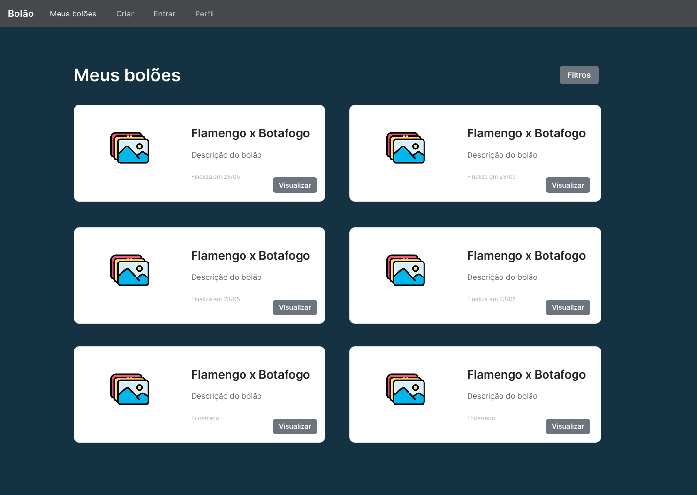
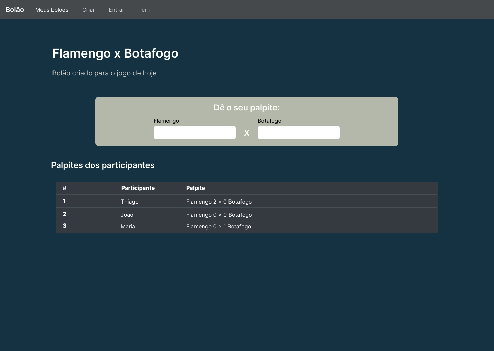
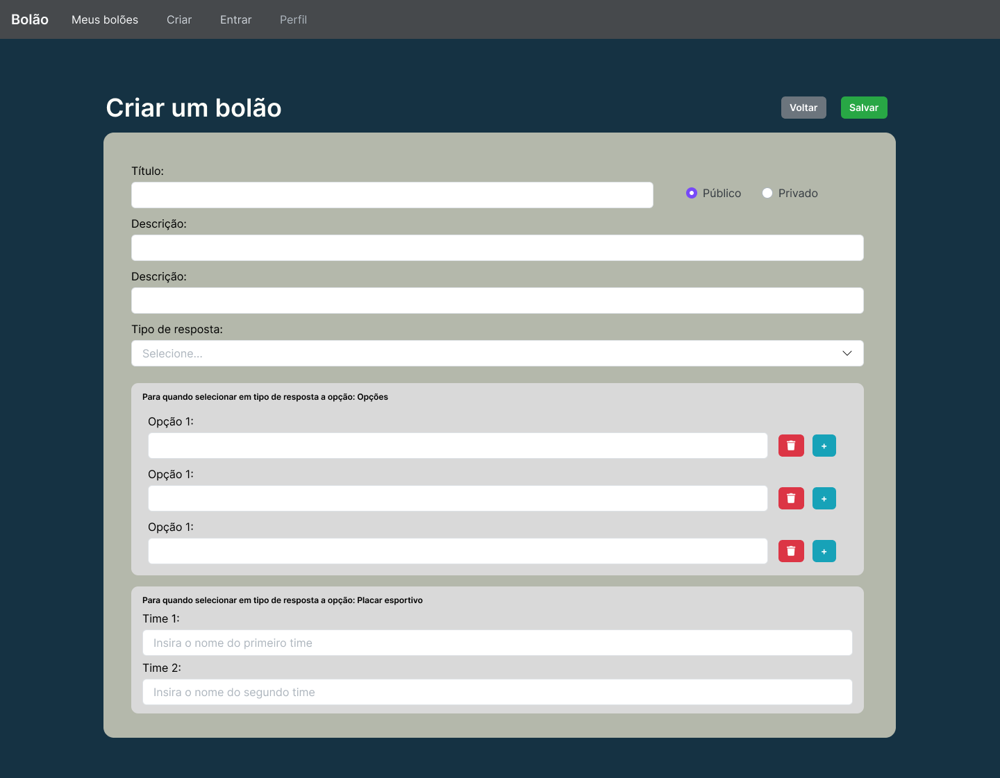
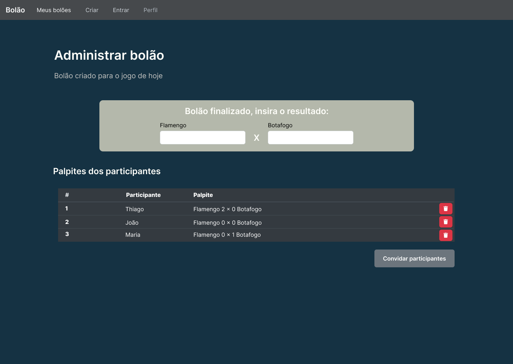
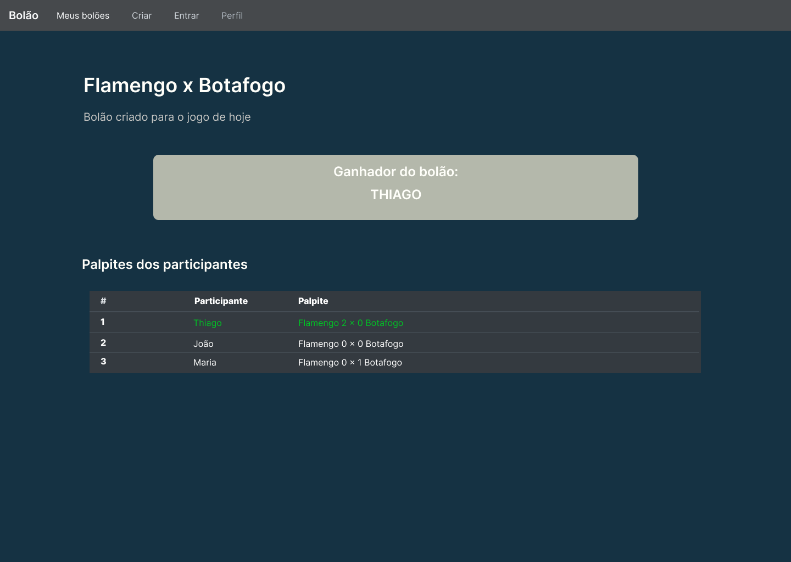
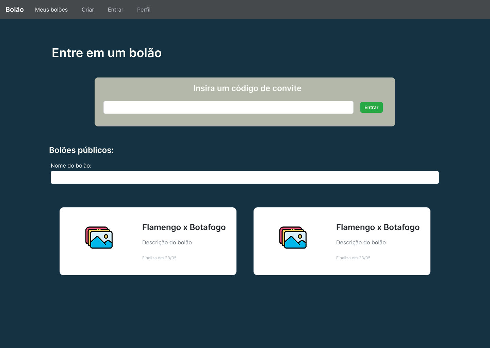

# 📘 Documentação do Projeto - Desenvolvimento Web

---

## 🧾 Visão Geral

Este projeto visa o desenvolvimento de um sistema de pedidos online. O sistema permite que clientes visualizem produtos, adicionem ao carrinho, finalizem compras e acompanhem pedidos. A seguir, detalhamos os principais artefatos exigidos para a entrega.

---

## ✅ Backlog

| ID    | Prioridade | História de Usuário                                                                 |
|-------|------------|--------------------------------------------------------------------------------------|
| HU-1  | 1️⃣         | **No papel de cliente**, desejo **visualizar uma lista de produtos com imagem e preço**, para poder escolher o que desejo comprar. |
| HU-2  | 2️⃣         | **No papel de cliente**, desejo **filtrar os produtos por categoria**, para encontrar mais rapidamente o que procuro. |
| HU-3  | 3️⃣         | **No papel de cliente**, desejo **adicionar um produto ao carrinho**, para organizar minha compra antes de finalizar. |
| HU-4  | 4️⃣         | **No papel de cliente**, desejo **visualizar os itens no meu carrinho com totais**, para acompanhar o valor da compra. |
| HU-5  | 5️⃣         | **No papel de cliente**, desejo **remover ou alterar a quantidade de itens no carrinho**, para ajustar minha compra. |
| HU-6  | 6️⃣         | **No papel de cliente**, desejo **finalizar o pedido com um clique**, para concluir minha compra com rapidez. |
| HU-7  | 7️⃣         | **No papel de cliente**, desejo **ver uma confirmação visual do pedido após finalizar**, para ter certeza que deu tudo certo. |
| HU-8  | 8️⃣         | **No papel de cliente**, desejo **me autenticar com login e senha**, para acessar meu histórico de pedidos e carrinho. |
| HU-9  | 9️⃣         | **No papel de cliente**, desejo **visualizar o histórico de pedidos realizados**, para acompanhar minhas compras anteriores. |
| HU-10 | 🔟         | **No papel de administrador**, desejo **visualizar todos os pedidos realizados**, para acompanhar e organizar a entrega. |

---

## 🎨 Protótipo de Telas

Cada funcionalidade de média/alta prioridade descrita no backlog possui uma tela representando sua interface/funcionalidade esperada.

### 🖼️ Protótipo do Requisito HU-1

Formulário de login para autenticação do usuário no sistema.

### 🖼️ Protótipo do Requisito HU-7

Tela de listagem de bolões que o usuário participa ou participou

### 🖼️ Protótipo do Requisito HU-4

Tela para visualização de informações do bolão fazer o papite

### 🖼️ Protótipo do Requisito HU-2, HU-3

Interface com formulário para a criação de um bolão

### 🖼️ Protótipo do Requisito HU-5

Interface para o criador do bolão administrar os participantes e o resultado.

### 🖼️ Protótipo do Requisito HU-6

Tela para visualizar um bolão após ele ter finalizado

### 🖼️ Protótipo do Requisito HU-1

Tela para buscar e entrar em bolões.

---

## 🏗 Análise e Projeto 

O projeto  do sistema 

### Modelo 

### Esboço da arquitetura geral (cliente-servidor)

### Autorização  e Autenticação 
A autorização no Strapi (a partir do v4 e mantida no v5) é baseada em perfis de usuários (roles) e permissões atribuídas a esses perfis. Ela define o que cada usuário pode ou não pode fazer ao interagir com os endpoints da API.

1. Tipos de usuários
O Strapi tem dois contextos principais de usuários:

🔹 Usuários Autenticados
Criados via cadastro/login na API pública.

Associados a uma role do tipo “Authenticated” ou outra personalizada.

Usam token JWT para acesso autenticado.

🔸 Usuários Administrativos
Criados via painel de administração do Strapi.

Usam o Strapi Admin Panel.

Gerenciados separadamente e com permissões diferentes.

### Tecnologias a serem utilizadas 
Strapi, HTML, CSS, SQLITE....

---

### Telas do sistema

**Figura 2**: Tela de listagem de produtos com imagem, nome e preço — correspondente à história de usuário HU-1.

