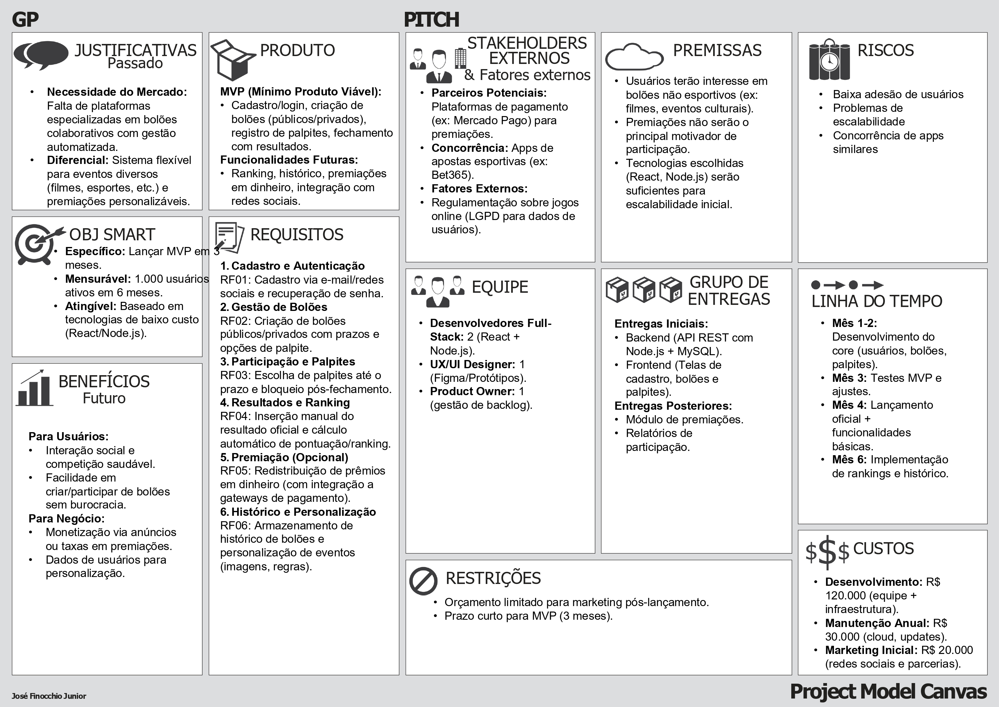
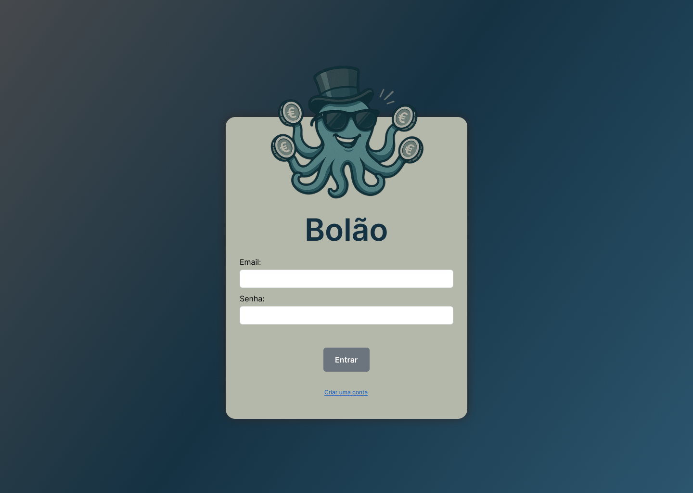
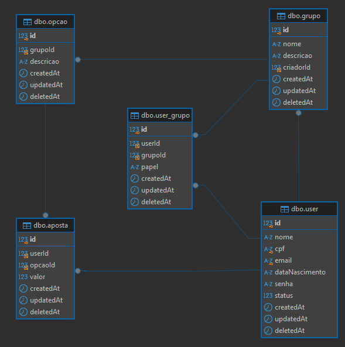

# 📘 Documentação do Bolão - Desenvolvimento Web

## 🧾 Visão Geral

O sistema permite que usuários participem de grupos e façam palpites sobre determinados eventos, sendo possível marcar quais palpites foram vencedores.

---

---

## ✅ Backlog

| ID    | Prioridade   | História de Usuário                                                                                                                     |
|-------|--------------|------------------------------------------------------------------------------------------------------------------------------------------|
| HU-1  | Alta         | No papel de usuário, desejo me cadastrar e fazer login, para poder participar dos bolões.                                               |
| HU-2  | Alta         | No papel de usuário, desejo criar um bolão público ou privado, para permitir que outros participem por convite ou código.               |
| HU-3  | Alta         | No papel de criador de bolão, desejo cadastrar opções de palpite, para que os participantes possam escolher entre elas.                 |
| HU-4  | Alta         | No papel de participante, desejo entrar em um bolão e fazer meus palpites, para tentar acertar o resultado antes do prazo.              |
| HU-5  | Média-Alta   | No papel de criador de bolão, desejo encerrar o bolão e registrar o resultado real, para definir os ganhadores.                         |
| HU-6  | Média        | No papel de usuário, desejo visualizar o ranking de participantes, para acompanhar meu desempenho em cada bolão e no geral.             |
| HU-7  | Média        | No papel de usuário, desejo ver o histórico de bolões e resultados, para consultar eventos anteriores e seus desfechos.                 |
| HU-8  | Baixa        | No papel de administrador, desejo que o sistema redistribua automaticamente a premiação, para seguir as regras definidas.               |
| HU-9  | Baixa        | No papel de participante, desejo ganhar pontos ou prêmios ao acertar palpites, conforme as regras definidas pelo criador do bolão.       |
| HU-10 | Baixa        | No papel de criador de bolão, desejo definir o tipo de evento e as regras de premiação, para personalizar o funcionamento do bolão.     |

---

## 🎨 Protótipo de Telas

Cada funcionalidade de média/alta prioridade descrita no backlog possui uma tela representando sua interface/funcionalidade esperada.

### 🖼️ Protótipo do Requisito HU-1

Formulário de login para autenticação do usuário no sistema.

### 🖼️ Protótipo do Requisito HU-7

Tela de listagem de bolões que o usuário participa ou participou.

### 🖼️ Protótipo do Requisito HU-4

Tela para visualização de informações do bolão fazer o papite.

### 🖼️ Protótipo do Requisito HU-2, HU-3

Interface com formulário para a criação de um bolão.

### 🖼️ Protótipo do Requisito HU-5

Interface para o criador do bolão administrar os participantes e o resultado.

### 🖼️ Protótipo do Requisito HU-6

Tela para visualizar um bolão após ele ter finalizado.

### 🖼️ Protótipo do Requisito HU-1

Tela para buscar e entrar em bolões.

---

### Tecnologias Previstas
- **Frontend:** React
- **UI Libraries:** MUI, Styled Components
- **Backend:** Node.js com Express
- **ORM:** Sequelize
- **Banco de Dados:** MySQL
- **Deploy:** (a definir)

---

## 🗃️ Modelagem de Dados

### Modelo 

### Entidades Principais

- **user**
  - Armazena informações dos usuários cadastrados.
  - Um usuário pode participar de vários grupos e fazer diversos palpites.

- **palpite**
  - Representa um palpite realizado em um grupo.
  - Pode ser marcado como vencedor.

- **grupo**
  - Define os grupos nos quais os usuários fazem palpites.
  - Um grupo pode conter vários palpites e múltiplos usuários.

- **user_palpite**
  - Representa a relação entre usuários e os palpites que eles fizeram.

- **user_grupo**
  - Representa a relação entre usuários e os grupos dos quais participam.

## 🏗️ Arquitetura da Aplicação

A aplicação será construída com uma arquitetura baseada em **API REST**:

- O **frontend em React** consumirá os dados por meio de requisições HTTP.
- O **backend em Express (Node.js)** será responsável por gerenciar as regras de negócio e expor as APIs.
- O **Sequelize** será utilizado como camada de abstração para o banco de dados **MySQL**.

